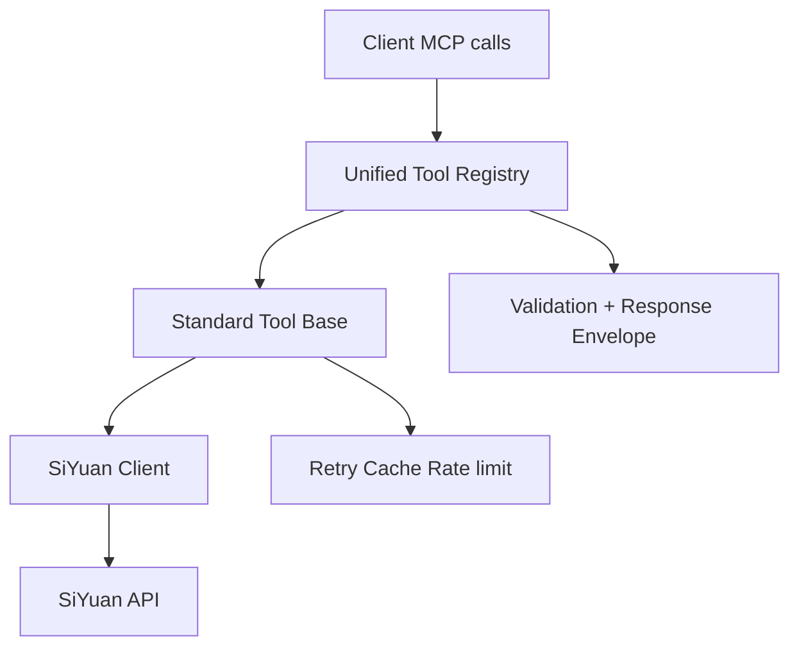

# Verbesserungsplan für den SiYuan MCP Server

## Umfang & geprüfte Quellen
- MCP-Server Einstieg + Handler: [`src/index.ts`](src/index.ts)
- Standardisierte Tool-Schicht: [`src/tools/standardizedTools.ts`](src/tools/standardizedTools.ts)
- API-Referenz: [`Knowledge/api.md`](Knowledge/api.md)
- Öffentliche Dokumentation: [`README.md`](README.md)

## Kernerkenntnisse (Snapshot)
1. **Fragmentierte Tool-Oberfläche**: direkte MCP-Handler in [`src/index.ts`](src/index.ts) koexistieren mit standardisierten Tools in [`src/tools/standardizedTools.ts`](src/tools/standardizedTools.ts) sowie zusammengeführten Tools via `handleMergedTool`. Das erzeugt Funktionsüberschneidungen, inkonsistente Benennungen und divergierende Schemata.
2. **API-Abdeckungslücken** vs [`Knowledge/api.md`](Knowledge/api.md): einige Endpunkte scheinen nicht exponiert (z. B. Notebook open/close, Dokument rename/remove/move by ID, File-Operationen, Notification, Network Proxy, System boot/version/time, SQL flush, etc.).
3. **Schema/Verhaltens-Mismatches**: Beispiele in [`README.md`](README.md) nennen Tools wie `update_document`, `get_document`, `list_documents`, die nicht im Top-Level MCP-Tool-Register von [`src/index.ts`](src/index.ts) erscheinen; Namenskonventionen mischen Dot-Style (`docs.create`) und Snake-Case (`create_document`).
4. **Fehler/Response-Standardisierung**: manche Handler liefern rohe JSON-Strings, andere kapseln Responses mit Erfolg-Metadaten; Fehlerbehandlung ist uneinheitlich (teilweise `try/catch`, teilweise rohe Fehlerweitergabe).
5. **Performance & Zuverlässigkeit**: grundlegendes Caching und Retry-Statistiken existieren, werden aber nicht konsequent auf alle Tools angewendet; Concurrency- und Rate-Limit-Verhalten ist nicht in den Tool-Schemata sichtbar.

---

## Zielbild
- **Vereinheitlichter, konsistenter MCP-Tool-Katalog**: ein Register, eine Namenskonvention, konsistente Schemata und Fehler-Responses.
- **Erweiterte API-Abdeckung** im Einklang mit [`Knowledge/api.md`](Knowledge/api.md).
- **Klare UX + Doku**: korrekte Tool-Liste, stabile Beispiele, vorhersehbare Responses.
- **Betriebliche Robustheit**: Retries, Timeouts, Caching und Limits konsistent angewandt.

---

## Geplante Verbesserungen (konkrete Aufgaben)

### 1) MCP-Tool-Registry + Naming vereinheitlichen
- [ ] Tool-Registrierung auf eine Quelle konsolidieren (bevorzugt standardisierte Tool-Schicht) und doppelte Handler in [`src/index.ts`](src/index.ts) deprecaten.
- [ ] **Eine Namenskonvention** festlegen (empfohlen `snake_case` für Alignment mit standardisierten Tools oder `namespace.action`, aber nicht beides) und veraltete Namen via Kompatibilitäts-Shims abbilden.
- [ ] Sicherstellen, dass die Tool-Liste in [`README.md`](README.md) dem tatsächlichen MCP-Registry-Stand entspricht.

### 2) API-Abdeckungslücken schließen (vs api.md)
- [ ] Fehlende Notebook-Operationen ergänzen: open/close/rename/create/remove + get/set notebook conf. Siehe [`Knowledge/api.md`](Knowledge/api.md).
- [ ] Dokument-Operationen ergänzen: rename/remove/move, path ↔ ID Konvertierung, create with Markdown by path, remove by ID.
- [ ] File-API abdecken: get/put/remove/rename/readDir. Siehe [`Knowledge/api.md`](Knowledge/api.md).
- [ ] System-Endpunkte ergänzen: boot progress, system version, current time (`/api/system/currentTime`) und Abgleich mit MCP `get_current_time` Verhalten.
- [ ] SQL `flushTransaction` sowie Notification-Endpunkte (`pushMsg`, `pushErrMsg`) ergänzen, falls relevant für Tool-Orchestrierung.
- [ ] Network forward proxy Tool (opt-in, sicherheitsgeprüft) ergänzen oder explizit als ausgeschlossen dokumentieren.

### 3) Schemata + Responses standardisieren
- [ ] Gemeinsames Response-Envelope definieren (z. B. `success`, `operation`, `data`, `error`, `timestamp`) für alle Tools.
- [ ] Sicherstellen, dass alle Tools **Input-Schemata** bereitstellen, die den SiYuan-API-Parametern in [`Knowledge/api.md`](Knowledge/api.md) entsprechen.
- [ ] Pflichtfelder konsistent validieren und Validierungsfehler mit klaren, aktionsfähigen Meldungen ausgeben.
- [ ] Suchergebnisse korrekt lokalisieren: Fallback `无标题` in [`src/tools/Tools.ts`](src/tools/Tools.ts) ersetzen, wenn `result.title` fehlt, und Titel ggf. via `rootID` nachladen.

### 4) Zuverlässigkeit, Performance & Limits
- [ ] Einheitliche Timeout/Retry/Caching-Strategie über alle Tools anwenden (über die standardisierte Tool-Basis). Siehe [`src/tools/standardizedTools.ts`](src/tools/standardizedTools.ts).
- [ ] Rate-Limit- oder Concurrency-Leitlinien in Tool-Beschreibungen und Doku sichtbar machen.
- [ ] Strukturierte Logs für Tool-Calls mit Korrelations-IDs ergänzen, um mehrstufige Operationen zu tracen.

### 5) Doku-Abgleich + Beispiele
- [ ] Tool-Liste in [`README.md`](README.md) an tatsächliche Registry und Namenskonventionen anpassen.
- [ ] Beispiel-Calls für neu ergänzte APIs aus [`Knowledge/api.md`](Knowledge/api.md) hinzufügen.
- [ ] Abschnitt „Tool-Kompatibilität“ ergänzen, der deprecate Namen und Migrationshinweise beschreibt.
- [ ] Alle chinesischen Texte (inkl. Kommentare, Logger-Meldungen, User-Strings) in den Quellen ins Englische übersetzen.

### 6) Security & Safety Review
- [ ] Prüfen, ob File- und Forward-Proxy-APIs standardmäßig sicher exponiert sind; ggf. explizite Opt-in Flags oder Allow-List ergänzen.
- [ ] Parameter-Validierung für Dateipfade und Größen ergänzen, um Missbrauch zu verhindern.

---

## Abhängigkeiten & Entscheidungen
- **Namenskonvention**: Entscheidung zwischen `snake_case` und `namespace.action`.
- **Security-Standpunkt**: ob forward-proxy/file APIs standardmäßig aktiviert werden.
- **Kompatibilitäts-Policy**: Aliase für Legacy-Tools beibehalten oder harte Breaking-Changes.

---

## Mermaid-Überblick (Vorschlag)

---

## Nächster Schritt
Plan prüfen und Umfang oder Prioritäten anpassen, danach ggf. in den Implementierungsmodus wechseln.
