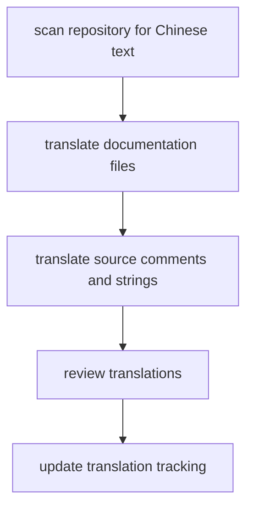

# Translation Plan for Chinese-to-English Sweep

## Objectives
1. Identify every occurrence of Chinese text in the repository, including documentation, comments, and log strings.
2. Translate each string into English while preserving format, context, and technical accuracy.
3. Document the changes so reviewers can verify coverage and approve further steps.

## Todo
- [ ] Scan the repository to catalog files containing Chinese text, prioritizing docs (`README.md`, translation tracking files) and then source files.
- [ ] Translate documentation content, keeping structural markup intact and capturing both the translated and original context where helpful.
- [ ] Replace Chinese comments, logger messages, and user-facing strings in the source while ensuring exported interfaces remain clear.
- [ ] Update translation tracking files (`TRANSLATION_PROGRESS.md`, `TRANSLATION_COMPLETION_SUMMARY.md`) to reflect completed sections.
- [ ] Run lint/type tooling if necessary to confirm no formatting breakage, then prepare a summary of translated files and pending work.

## Workflow Diagram

